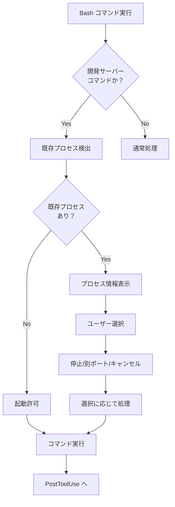
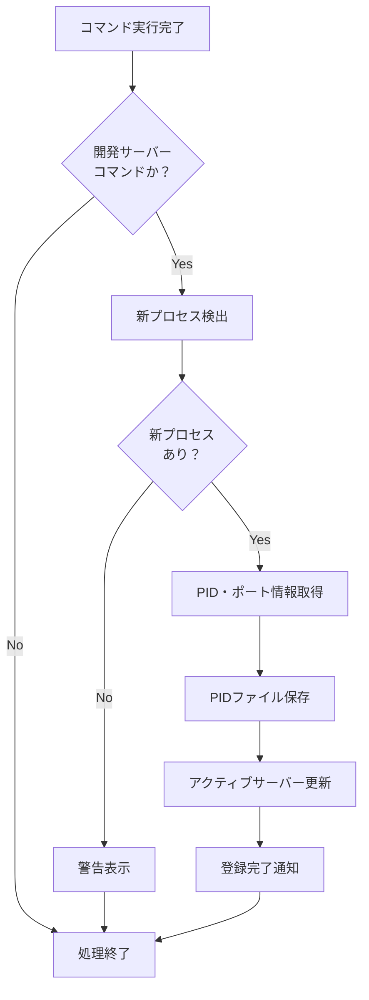
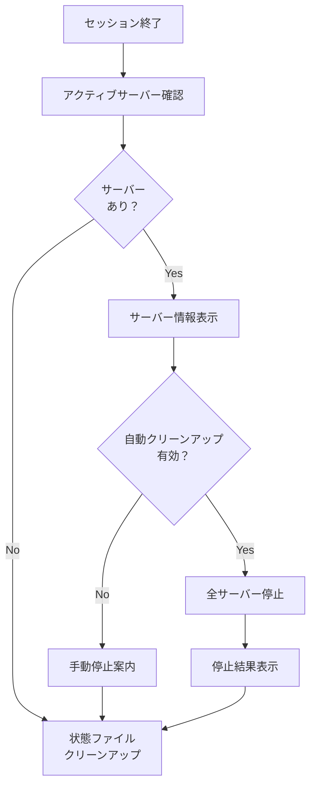

# 📋 開発サーバー管理システム仕様書

## 🎯 概要

Claude Code用の開発サーバー自動管理システムです。npm run devなどの開発サーバーが立ち上げっぱなしになることを防ぎ、プロセス重複やポート競合を回避する包括的な管理機能を提供します。

### 📊 システム概要図

```
┌─────────────────────────────────────────────────────────────────┐
│                    Claude Code Hooks System                    │
├─────────────────────────────────────────────────────────────────┤
│  PreToolUse    │  PostToolUse   │      Stop                    │
│  (Bash)        │  (Bash)        │  (Session End)               │
│       │        │       │        │       │                      │
│       ▼        │       ▼        │       ▼                      │
├─────────────────────────────────────────────────────────────────┤
│             開発サーバー監視・管理システム                        │
│  ┌─────────────┐ ┌─────────────┐ ┌─────────────┐              │
│  │   Monitor   │ │   Cleanup   │ │   Manager   │              │
│  │   (監視)    │ │ (クリーンアップ) │ │  (統合管理)  │              │
│  └─────────────┘ └─────────────┘ └─────────────┘              │
│         │               │               │                      │
│         ▼               ▼               ▼                      │
│  ┌─────────────────────────────────────────────────────────┐    │
│  │              Utils (共通ユーティリティ)                 │    │
│  └─────────────────────────────────────────────────────────┘    │
├─────────────────────────────────────────────────────────────────┤
│                   状態管理ディレクトリ                           │
│  ┌─────────────┐ ┌─────────────┐ ┌─────────────┐              │
│  │active-servers│ │   ports     │ │   pids/     │              │
│  │   .json     │ │   .json     │ │   *.pid     │              │
│  └─────────────┘ └─────────────┘ └─────────────┘              │
└─────────────────────────────────────────────────────────────────┘
```

### 🔧 主要機能

1. **プロセス重複検出**: 新しい開発サーバー起動前に既存プロセスを自動検出
2. **ポート競合回避**: 3000-3005番ポートの使用状況を監視
3. **セッション管理**: Claude Code セッション終了時の自動クリーンアップ
4. **状態追跡**: 全サーバーのPID、ポート、実行時間をJSON形式で記録
5. **対話モード**: ユーザーフレンドリーなメニュー操作
6. **hooks統合**: Claude Code hooks システムとの完全統合

## 📁 ファイル構成

### スクリプトファイル (`.claude/scripts/`)

```
.claude/scripts/
├── dev-server-utils.sh        # 共通ユーティリティ関数
├── dev-server-monitor.sh      # プロセス監視機能 (hooks用)
├── dev-server-cleanup.sh      # クリーンアップ・停止機能
└── dev-server-manager.sh      # 統合管理フロントエンド
```

### 状態管理ディレクトリ (`.claude/dev-server-state/`)

```
.claude/dev-server-state/
├── active-servers.json        # アクティブサーバー一覧
├── ports.json                 # ポート使用履歴
├── config.json                # システム設定
├── pids/                      # PIDファイル保存ディレクトリ
│   └── {PID}.pid             # 個別プロセス情報
└── README.md                  # 状態管理ドキュメント
```

### 設定ファイル

```
.claude/settings.json          # Claude Code hooks設定
```

## 🔄 動作フロー

### 1. 開発サーバー起動時 (PreToolUse)



### 2. 開発サーバー起動後 (PostToolUse)



### 3. セッション終了時 (Stop)



## 📋 各スクリプト詳細仕様

### 1. dev-server-utils.sh

**概要**: 共通ユーティリティ関数を提供するライブラリスクリプト

**主要機能**:
- プロセス検出・管理
- ポート使用状況確認
- PID管理
- 状態ファイル操作
- ログ出力

**主要関数**:

| 関数名 | 機能 | 引数 | 戻り値 |
|--------|------|------|--------|
| `detect_dev_servers()` | 開発サーバープロセス検出 | なし | プロセス一覧 |
| `is_port_in_use()` | ポート使用確認 | port | 0/1 |
| `get_port_process()` | ポート使用プロセス取得 | port | プロセス情報 |
| `save_server_pid()` | PID情報保存 | pid, port, path, session | なし |
| `stop_process_gracefully()` | プロセス安全停止 | pid, timeout | 0/1 |
| `get_active_servers()` | アクティブサーバー取得 | なし | JSON配列 |

**環境変数**:
- `DEV_SERVER_LOG_LEVEL`: ログレベル (0-3)
- `CLAUDE_DIR`: Claude設定ディレクトリ

### 2. dev-server-monitor.sh

**概要**: hooks システムから呼び出されるプロセス監視スクリプト

**使用方法**:
```bash
echo "npm run dev" | dev-server-monitor.sh pre   # 事前チェック
echo "npm run dev" | dev-server-monitor.sh post  # 事後処理
```

**主要機能**:
- 開発サーバーコマンド検出
- 既存プロセス競合チェック
- ポート競合警告
- 新プロセス登録

**検出パターン**:
- `npm.*run.*dev`, `npm.*dev`
- `pnpm.*run.*dev`, `pnpm.*dev`
- `yarn.*dev`
- `next.*dev`
- `npx.*next.*dev`

**環境変数**:
- `DEV_SERVER_AUTO_STOP`: 自動停止有効化

### 3. dev-server-cleanup.sh

**概要**: 開発サーバーの停止・クリーンアップ機能を提供

**使用方法**:
```bash
dev-server-cleanup.sh session-end           # セッション終了処理
dev-server-cleanup.sh stop <pid>            # 特定PID停止
dev-server-cleanup.sh stop-all              # 全サーバー停止
dev-server-cleanup.sh cleanup-orphaned      # 孤立プロセス削除
dev-server-cleanup.sh status               # 状況表示
```

**主要コマンド**:

| コマンド | 機能 | オプション |
|----------|------|-----------|
| `session-end` | セッション終了時処理 | `--force` |
| `stop <pid>` | 特定プロセス停止 | `--timeout N` |
| `stop-all` | 全プロセス停止 | `--force` |
| `cleanup-orphaned` | 孤立プロセス削除 | `--force` |
| `cleanup-state` | 状態ファイル整理 | なし |
| `status` | 現在の状況表示 | なし |

**環境変数**:
- `DEV_SERVER_AUTO_CLEANUP`: 自動クリーンアップ有効化
- `DEV_SERVER_CLEANUP_TIMEOUT`: 停止タイムアウト(秒)

### 4. dev-server-manager.sh

**概要**: 統合管理フロントエンド・対話モード

**使用方法**:
```bash
dev-server-manager.sh                       # 対話モード
dev-server-manager.sh start "npm run dev"   # 安全起動
dev-server-manager.sh stop <pid>            # プロセス停止
dev-server-manager.sh status               # 状況表示
dev-server-manager.sh install              # hooks インストール
dev-server-manager.sh test                 # システムテスト
```

**主要コマンド**:

| コマンド | 機能 | 説明 |
|----------|------|------|
| `start` | 安全起動 | 既存プロセス確認後起動 |
| `stop` | プロセス停止 | 特定PID停止 |
| `stop-all` | 全停止 | 全サーバー停止 |
| `status` | 状況確認 | 現在の状況表示 |
| `cleanup` | クリーンアップ | 孤立プロセス削除 |
| `install` | hooks インストール | settings.json更新 |
| `uninstall` | hooks 削除 | settings.json から削除 |
| `test` | システムテスト | 動作確認 |

**対話モード機能**:
1. 現在の状況表示
2. サーバー起動
3. サーバー停止
4. 全サーバー停止
5. クリーンアップ実行
6. 設定確認
7. ログ表示
8. システムテスト

## 📊 状態管理

### active-servers.json

```json
{
  "activeServers": [
    {
      "pid": 12345,
      "port": 3000,
      "projectPath": "/workspace/knowledge/nextjs",
      "sessionId": "user-12345",
      "startTime": "2025-07-15T15:30:00Z"
    }
  ],
  "lastUpdated": "2025-07-15T15:30:00Z",
  "version": "1.0.0"
}
```

### ports.json

```json
{
  "portHistory": [
    {
      "port": 3000,
      "pid": 12345,
      "timestamp": "2025-07-15T15:30:00Z",
      "projectPath": "/workspace/knowledge/nextjs"
    }
  ],
  "defaultPorts": [3000, 3001, 3002, 3003, 3004, 3005],
  "lastUpdated": "2025-07-15T15:30:00Z",
  "version": "1.0.0"
}
```

### config.json

```json
{
  "autoStop": false,
  "autoCleanup": false,
  "cleanupTimeout": 10,
  "logLevel": 2,
  "monitoredPorts": [3000, 3001, 3002, 3003, 3004, 3005],
  "excludePatterns": ["grep", "dev-server"],
  "systemSettings": {
    "enableHooks": true,
    "sessionTracking": true,
    "processMonitoring": true
  },
  "lastUpdated": "2025-07-15T15:30:00Z",
  "version": "1.0.0"
}
```

### PIDファイル ({PID}.pid)

```json
{
  "pid": 12345,
  "port": 3000,
  "projectPath": "/workspace/knowledge/nextjs",
  "sessionId": "user-12345",
  "startTime": "2025-07-15T15:30:00Z",
  "commandLine": "npm run dev",
  "workingDirectory": "/workspace/knowledge/nextjs"
}
```

## ⚙️ 設定・環境変数

### 必須環境変数

| 変数名 | デフォルト | 説明 |
|-------|-----------|------|
| `DEV_SERVER_LOG_LEVEL` | `2` | ログレベル (0=ERROR, 1=WARN, 2=INFO, 3=DEBUG) |

### オプション環境変数

| 変数名 | デフォルト | 説明 |
|-------|-----------|------|
| `DEV_SERVER_AUTO_STOP` | `false` | 自動停止有効化 |
| `DEV_SERVER_AUTO_CLEANUP` | `false` | 自動クリーンアップ有効化 |
| `DEV_SERVER_CLEANUP_TIMEOUT` | `10` | 停止タイムアウト(秒) |
| `CLAUDE_DIR` | `$(pwd)/.claude` | Claude設定ディレクトリ |

### hooks設定 (.claude/settings.json)

```json
{
  "hooks": {
    "PreToolUse": [
      {
        "matcher": "Bash",
        "hooks": [{
          "type": "command",
          "command": "bash -c 'if [ -f .claude/scripts/dev-server-monitor.sh ]; then echo \"$TOOL_INPUT\" | .claude/scripts/dev-server-monitor.sh pre; fi'"
        }]
      }
    ],
    "PostToolUse": [
      {
        "matcher": "Bash",
        "hooks": [{
          "type": "command",
          "command": "bash -c 'if [ -f .claude/scripts/dev-server-monitor.sh ]; then echo \"$TOOL_INPUT\" | .claude/scripts/dev-server-monitor.sh post; fi'"
        }]
      }
    ],
    "Stop": [
      {
        "hooks": [{
          "type": "command",
          "command": "bash -c 'if [ -f .claude/scripts/dev-server-cleanup.sh ]; then .claude/scripts/dev-server-cleanup.sh session-end; fi'"
        }]
      }
    ]
  }
}
```

## 🚀 セットアップ手順

### 1. 初期インストール

```bash
# hooks システムにインストール
.claude/scripts/dev-server-manager.sh install

# 動作確認
.claude/scripts/dev-server-manager.sh test
```

### 2. 環境設定 (オプション)

```bash
# 自動停止を有効化
export DEV_SERVER_AUTO_STOP=true

# 自動クリーンアップを有効化  
export DEV_SERVER_AUTO_CLEANUP=true

# タイムアウト設定
export DEV_SERVER_CLEANUP_TIMEOUT=15
```

### 3. 動作確認

```bash
# 現在の状況確認
.claude/scripts/dev-server-manager.sh status

# 対話モードでテスト
.claude/scripts/dev-server-manager.sh
```

## 🔍 使用例

### 基本的な使用フロー

1. **開発サーバー起動**:
   ```bash
   npm run dev
   ```
   → 自動的に既存プロセスチェック実行

2. **重複検出時の選択**:
   ```
   ⚠️  既存の開発サーバーが検出されました:
      🚀 npm (PID: 12345) - ポート 3000 - 起動から2時間
   
   選択してください:
   1) 既存サーバーを停止して新しいサーバーを起動
   2) 別のポートで新しいサーバーを起動
   3) キャンセル
   ```

3. **セッション終了時**:
   ```
   🔍 アクティブな開発サーバーが検出されました:
      🚀 PID: 12345 - ポート: 3000 - 実行時間: 2時間
   
   💡 ヒント: 自動クリーンアップを有効にするには DEV_SERVER_AUTO_CLEANUP=true を設定してください
   ```

### 手動操作例

```bash
# 状況確認
.claude/scripts/dev-server-manager.sh status

# 特定プロセス停止
.claude/scripts/dev-server-cleanup.sh stop 12345

# 全サーバー停止
.claude/scripts/dev-server-cleanup.sh stop-all

# 孤立プロセス削除
.claude/scripts/dev-server-cleanup.sh cleanup-orphaned

# 対話モード起動
.claude/scripts/dev-server-manager.sh
```

## 🛠️ トラブルシューティング

### よくある問題

1. **サーバーが起動しない**
   ```bash
   .claude/scripts/dev-server-cleanup.sh cleanup-orphaned
   ```

2. **ポート競合エラー**
   ```bash
   .claude/scripts/dev-server-manager.sh status
   ```

3. **セッション終了後もプロセスが残る**
   ```bash
   export DEV_SERVER_AUTO_CLEANUP=true
   ```

4. **hooks が動作しない**
   ```bash
   .claude/scripts/dev-server-manager.sh install
   ```

5. **状態ファイルが破損**
   ```bash
   .claude/scripts/dev-server-cleanup.sh cleanup-state
   ```

### ログ・デバッグ

```bash
# デバッグモード
export DEV_SERVER_LOG_LEVEL=3
.claude/scripts/dev-server-manager.sh status

# 詳細ログ
DEV_SERVER_LOG_LEVEL=3 bash -x .claude/scripts/dev-server-monitor.sh pre <<< "npm run dev"
```

### 手動リセット

```bash
# 全状態クリア
rm -rf .claude/dev-server-state/pids/*
echo '{"activeServers": []}' > .claude/dev-server-state/active-servers.json

# 強制的な全プロセス停止
pkill -f "npm.*dev"
pkill -f "next.*dev"
```

## 📈 拡張・カスタマイズ

### 監視対象パターン追加

`dev-server-utils.sh`の`DEV_SERVER_PATTERNS`配列に追加:

```bash
readonly DEV_SERVER_PATTERNS=(
  "next.*dev"
  "node.*dev"
  "npm.*dev"
  "pnpm.*dev"
  "yarn.*dev"
  "npx.*dev"
  "custom.*dev"  # 追加例
)
```

### 監視ポート範囲変更

`dev-server-utils.sh`の`DEFAULT_PORTS`配列を変更:

```bash
readonly DEFAULT_PORTS=(3000 3001 3002 3003 3004 3005 8000 8080)
```

### 自動停止ロジック強化

`dev-server-monitor.sh`の`handle_user_choice`関数をカスタマイズ可能

## 🔒 セキュリティ考慮事項

1. **プロセス権限**: 同一ユーザーのプロセスのみ操作
2. **ファイル権限**: 状態ファイルは適切なパーミッション設定
3. **コマンド注入**: 入力値は適切にエスケープ処理
4. **PID検証**: プロセス存在確認を必須実装

## 📋 バージョン管理

- **バージョン**: 1.0.0
- **更新日**: 2025-07-15
- **互換性**: Claude Code hooks システム対応

## 🤝 サポート・貢献

問題報告やバグ修正は GitHub Issues で管理してください。

---

*この仕様書は開発サーバー管理システム v1.0.0 の完全な技術仕様を記録しています。*